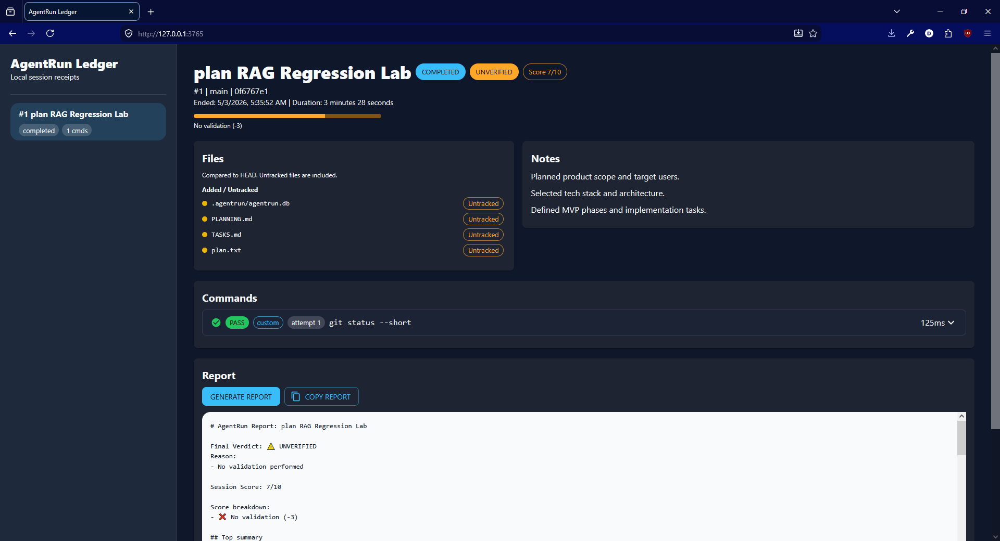
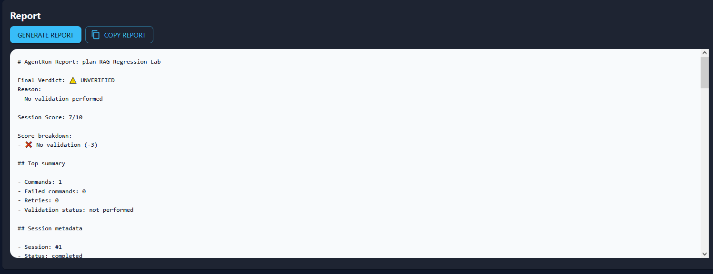
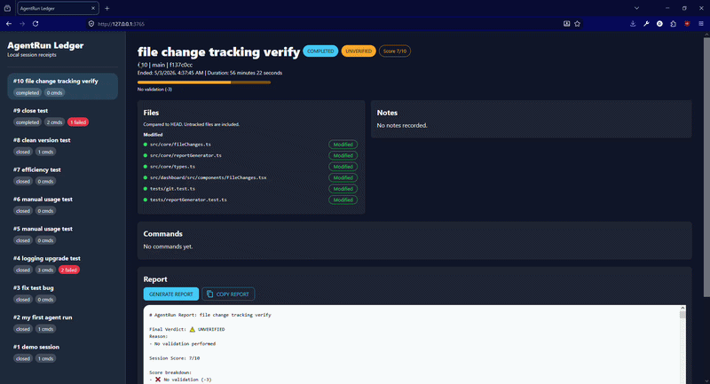
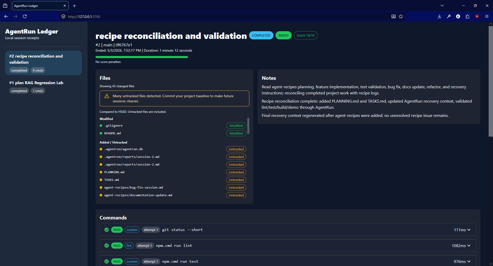

# 🚀 AgentRun Ledger


> 🧾 Local session receipts for AI coding agents

---

## 🧠 What is AgentRun Ledger?

AgentRun Ledger is a **local-first CLI + dashboard** that records what your AI agent actually did during a session.

It captures:

* 📂 Files changed (added / modified / deleted)
* ⚙️ Commands executed (with pass/fail)
* 📝 Human notes
* 📊 Session scoring & risks
* 📄 Auto-generated Markdown reports

Think of it as:

> 🔍 **Git + Logs + AI audit trail — all in one place**

---

## 🎯 How is this Helpful ?

After a long session, you usually have:

* No clear audit trail
* No idea what failed silently
* No structured way to review

AgentRun Ledger fixes that by generating a **deterministic, reviewable session report**.

---

## ⚡ Demo Flow

```bash
npm install
npm run build

npm run dev -- init
npm run dev -- start "demo agent session"

npm run dev -- note "Testing AgentRun Ledger."
npm run dev -- run "node -e \"console.log('hello')\""

npm run dev -- report
npm run dev -- dashboard
```

Open dashboard:
👉 http://127.0.0.1:3765

---

## 🖥️ Dashboard Preview




What you’ll see:

* Session timeline
* File changes with status badges
* Command execution logs
* Notes
* Live report preview

---

## 📊 Example Report



---

## 📸 Demo



---

```md
# AgentRun Report: demo agent session

## Summary

- Changed files: 3
- Commands logged: 2
- Passed commands: 1
- Failed commands: 1

## Review risks

- **DANGER: Failed commands exist**
```

---

## 🛠️ Installation

### Local development

```bash
npm install
npm run build
```

### Global CLI (recommended)

```bash
npm link
```

Then use anywhere:

```bash
agentrun init
agentrun start "my session"
```

---

## ⚙️ CLI Commands

```bash
agentrun init
agentrun start "task name"
agentrun snapshot before
agentrun snapshot after
agentrun run "npm test"
agentrun note "Agent updated retry logic"
agentrun status
agentrun list
agentrun report
agentrun dashboard --port 3765
```

---

## 🤖 Works With Any AI Agent

AgentRun Ledger is **agent-agnostic**.

Use it with:

* Codex
* Gemini CLI
* Local LLMs
* Any script or automation

Just wrap actions like:

```bash
agentrun run "your command"
```

---

## 🧪 Development Workflow Example

```bash
agentrun start "implement feature X"

agentrun run "npm install"
agentrun run "npm run build"

agentrun note "Added API layer and validation"

agentrun report
```

---

## 🧩 How It Works

* Uses **Git diff vs HEAD** to track file changes
* Stores session data in `.agentrun/agentrun.db`
* Generates deterministic reports (no AI required)
* Dashboard reads local DB only

No cloud. No API keys. No tracking.

---

## ⚠️ Notes & Limitations

* Requires Node 24+ (uses `node:sqlite`)
* SQLite warning is expected (experimental feature)
* No full terminal recording (command-level only)
* Reports are heuristic-based (not AI-generated)

---

## 🗺️ Using Agent Recipes

AgentRun Ledger includes pre-built **agent recipes** to standardize workflows.

These are located in:

```
agent-recipes/
```

---

### 🎯 How to Use with AI Agents (Codex / Gemini)

When starting a task, explicitly instruct the agent to:

1. **Read the recipe file**
2. **Follow it step-by-step**
3. **Execute all commands via `agentrun`**

---

### 🧠 Example Prompt (Planning Task)

```text
Before doing anything:

1. Open and read:
   agent-recipes/planning-session.md

2. Follow it strictly.

3. Do not skip steps.

4. Use agentrun for:
   - starting session
   - logging commands
   - adding notes
   - generating report

Task:
Plan a RAG Regression Lab project.
```

---

### ⚙️ Example Prompt (Feature Work)

```text
Before starting:

1. Read:
   agent-recipes/feature-implementation.md

2. Follow all steps exactly.

3. All commands must go through:
   agentrun run "<command>"

Task:
Implement API layer for RAG system.
```

---

### 🔁 Recovery After Reset

```text
You were previously working on this project.

Before continuing:

1. Read:
   agent-recipes/recovery-after-reset.md

2. Follow it strictly.

3. Resume from last AgentRun report.
```

---

## 📌 Important Rules

* Always reference recipe **by path**
* Always say **"read this file first"**
* Always enforce **step-by-step execution**

If you don’t do this, the agent will ignore your system.

---

# Agent Recipes

This folder contains standardized workflows for AI agents.

## Available Recipes

* planning-session.md → planning only
* feature-implementation.md → feature development
* bug-fix-session.md → debugging
* refactor-session.md → safe refactoring
* test-and-validation.md → testing
* documentation-update.md → docs work
* recovery-after-reset.md → resume sessions

## Usage Rule

Before any task:

1. Select the appropriate recipe
2. Read it fully
3. Follow it strictly
4. Use AgentRun Ledger for all actions




---

## 📄 License

MIT
